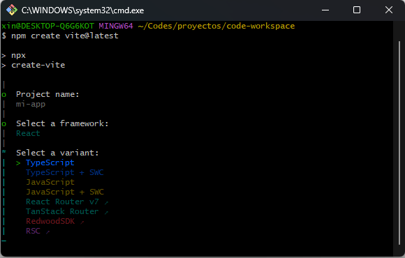
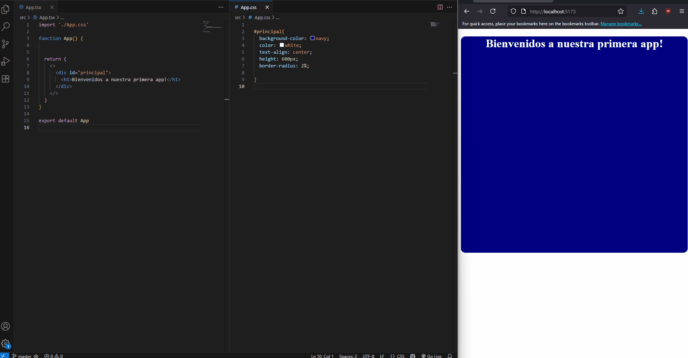

# Clases de React para el CFL 414

Este repo esta creado en calses, se irá actualizando mientras estas avancen.
El estado inicial de esta App es simplente un archivo con un solo componente.

## Objetivos

- Conocer el framework React
- Aprender el funcionamiento de los componentes
- Configurar Vite
- Manjar el framework CSS Tailwind
- Instalar y utilizar dependencias
- Continuar el aprendizaje de HTML y CSS

## NodeJs
Node es el entorno de ejecucion de JavaScript (algo asi como la JVM de java), se utiliza para ejecutar codigo JavaScript por fuera del navegador, esto permite escribir programas en JS, ejecutarlo en un servidor y enviarle al cliente el sitio renderizado ([server side rendering](#ssr))


>Lo podemos instalar con el archivo ejecutable o descomprimirlo en un directorio y configurar las [Variables de entorno](#variables-de-entorno) del sistema operativo.

### Comandos de creacion

Primero abrimos un bash de git en un directorio de nuestra pc donde queremos guardar nuestros proyectos de vite


luego, en la terminal escribimos el comando

```
npm create vite@latest
```


Vemos que Vite nos empieza a guiar por el asistente de creación. Lo primero que nos pide es el nombre de la app


[React](#react) es el framework que utilizaremos para crear nuestra interfaz




[Typescript](#typescript) tiene muchas ventajas contra JavaScript, principalmente la deteccion de errores al momento de codificar


En este punto ya podemos abrir nuestro ide y ubicar la carpeta de nuestra app,
luego ejecutar los comandos en el bash

```bash
cd mi-app/ #se mueve a la carpeta app
npm install/ #instala dependencias 
npm run dev #ejecuta la aplicación
```
---

Cuando se ejecuta npm con el comando run, **nuestro bash se queda corriendo la aplicacion**, si lo cerramos **se apaga la app**

Dejamos el bash minimizado y abrimos otro en la carpeta de la app


Ya tenemos nuestra aplicación ejecutandose, podemos ingresar la url localhost:5173 en cualquier navegador y ver la página por defecto.

Ahora podemos hacer un repositorio con git y nuestro primer commit

```bash
git init #crea el repositorio de git
git add . #agrega los archivos a stage 
git commit -m "commit inicial" #primer commit
```

Borramos el contenido de index.css y dejamos el archivo app.tsx de esta manera.


```JavaScript
import './App.css'

function App() {


  return (
    <>
      <div id="principal">
        <h1>Bienvenidos a nuestra primera app!</h1>
      </div>
    </>
  )
}

export default App
```

También configuramos el estilo en el archivo App.css

```CSS

#principal{
  background-color: navy;
  color: white;
  text-align: center;
  height: 600px;
  border-radius: 2%;

}

```

Todos los cambios que hacemos en el código, se ven reflejados en tiempo real, ya que la el sitio se esta ejecutando en un servidor, y no en el navegador. Este es el [modelo cliente servidor](#modelo-cliente-servidor)





Tenemos nuestra base creada, es momento de hacer un commit, ahora falta instalar las [dependencias](#dependencias). Por el momento vamos a instalar [tailwindcss](#tailwindcss) y [react-router](#react router)

Antes de instalar las dependencias, tenemos que detener la app apretando ctrl + c en el bash que la tiene en ejecucion, despues ejecutamos

```bash
npm install react-router
npm install tailwindcss @tailwindcss/vite
```

Ya que tenemos las dependencias instaladas, hay que configurarlas. Primero el Router.

Basicamente, lo que tenemos que lograr es que nuestra app responda a las acciones o solicitudes de los clientes, esto lo hacemos con **enrutamiento**.

```JavaScript
app.get('/', function (req, res) { res.send{'Hola Mundo!'}} )
```
Aca se muestra como una funcion devuelve "Hola mundo" cuando se le envía un mensaje HTTP GET a la carpeta raíz de la app(/).

Un enrutador es la herramienta que vamos a utilizar para gestionar estas rutas.

Ya tenemos instalada la dependencia, asi que podemos utilizar importar react-router y crear nuestras rutas.